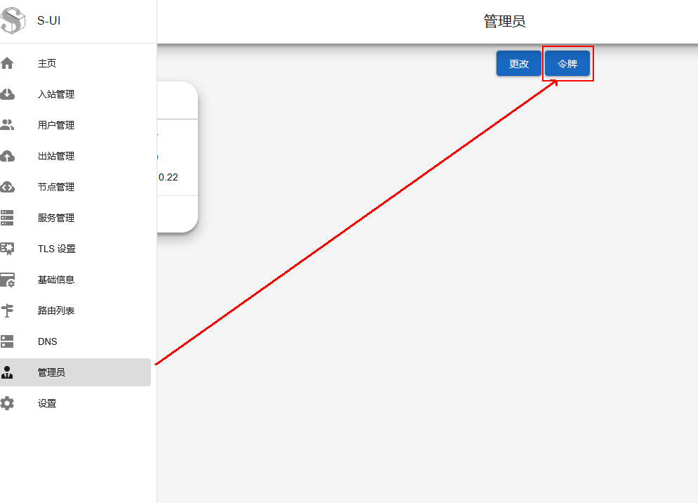
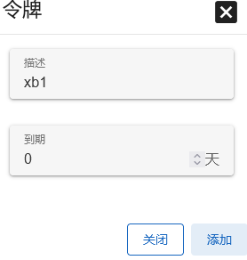
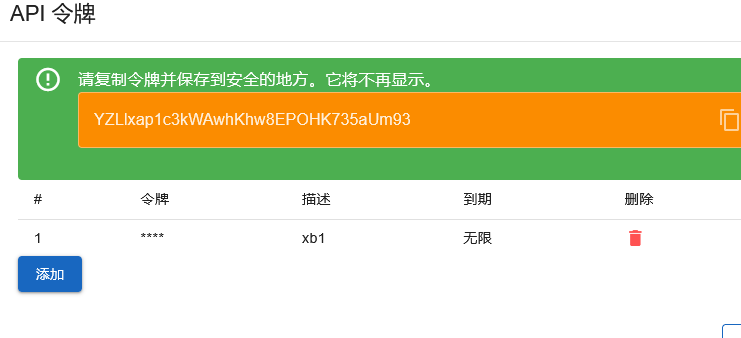

# 对接设置说明

#### 此文档为v0.9以及之后版本，此前版本参考首页

配置json示例如下：
```json
	"xui-config": {
		"ApiHost": "http://127.0.0.1:2053",
		"user": "admin",
		"passwd": "admin",
		"api-token":"MAZAAAAAAAAAAAAAAAAAAA",
		"NodeID": 1,
		"admin-path": "",
		"plugin":"./xboard2xui-3xui2.9.x-linux-and64",
		"plugin_watchdog":false
	}
```

### plugin 3xui2.9.x，即传统3xui，参考主页教程
使用传统user:passwd，适配3xui 2.x.x版本

<br>

---

### plugin 3xui3.1.x，3xui 3.x新版。
需要使用api-token，user:passwd在3.x新版已弃用

<br>

---

### plugin sui1.x，即S-UI（singbox），需要使用api-token对接，user:passwd将忽略。

S-UI生成一个api-token，过期时间填"0"（即不过期）







<br>

获取api-token后填入`"api-token":"..."`项，S-UI的默认路径为`"admin-path": "/app"`，如果自行修改了，可填入修改路径

#### 注意：
S-UI的`"NodeID": ${id}`依然是必须项，此id实际上是客户端的绑定的Inbounds，一般是随着卡片递增。（S-UI会把此出站显示为Inbounds tag name，但实际上需要 Inbounds id），Inbounds id可以直接打开`/${path}/api/load，(默认是"/app/api/load")`从Inbounds tag name找到。


`/${path}/api/load`找到下面的json结构
```
		"inbounds": [
			{
				"id": 1,
				"listen": "::",
				"listen_port": 30892,
				"tag": "vless-30892",
				"tls_id": 0,
				"type": "vless",
				"users": []
			},
			...
		],
		...
```

`"tag":"vless-30892"`这个就是面板显示的Inbounds tag name，这里需要,即`"id":1`,Inbounds id就是1

<br>

#### 对接S-UI与对接X-UI流程一样，先添加入站，获取到"NodeID"（Inbounds id），然后填写参数对接

<br>

---

### plugin xuiold，即传统xui。
需要使用user:passwd对接，由于传统xui分支过多，兼容性未知。

<br>

---

## 其他事项

v0.9版本插件较新，兼容性未知。有bug可及时反馈。

如果使用旧版本3xui，可使用旧版本xboard2xui

<br>

---

## 常见问题排查

另外，路由以及出站，以及禁止，在xui/sui里面配置，xboard的配置不起作用，会被xui/sui本身覆盖

如果节点不通，可以对比下xui/sui与xboard下发配置的差异，从而找出问题。